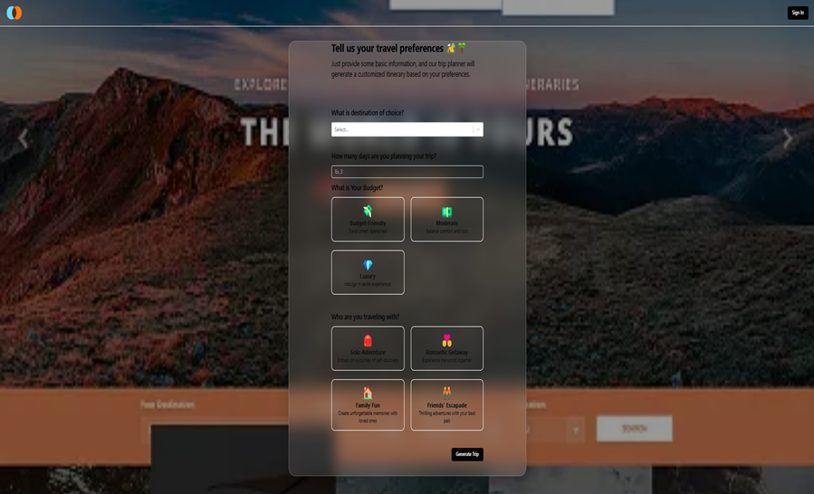

# 🌍 Tourify – AI-Powered Travel Itinerary Planner

**Tourify** is a smart, AI-driven travel itinerary generator built using **Java**, **Spring Boot**, **MySQL**, and **React**. It helps users plan personalized travel experiences, book services, optimize budgets, and get real-time recommendations – all in one platform!

---

## 🚀 Features

- **AI-Powered Itinerary Generation**  
- **Hotel, Flight & Local Transport Booking**  
- **Smart Budget Optimization**  
- **Real-Time Weather Forecasting**  
- **Google Maps Integration**  
- **Expense Splitter for Groups**  
- **Trip Collaboration & Sharing**  
- **Local Event Alerts & Recommendations**  
- **Offline Access & Itinerary Export (PDF)**  
- **AI Chatbot for Travel Help**

---

## 💻 Tech Stack

| Layer       | Technology                 |
|-------------|----------------------------|
| Frontend    | React, Vite, HTML, CSS, JS |
| Backend     | Java, Spring Boot          |
| Database    | MySQL                      |
| APIs Used   | Google Places API, OpenWeatherMap, Gemini AI (chatbot) |
| Tools       | Postman, VS Code, Git, GitHub |

---

---

## Screenshots





---

## 🛠️ Setup Instructions

### 📌 Prerequisites
- Java 17+
- Node.js 18+
- MySQL Server
- Maven
- Git

---

### 🔧 Backend Setup

```bash
cd backend
mvn clean install
mvn spring-boot:run
```

### 🔧 Frontend Setup
```
cd frontend
npm install
npm run dev
